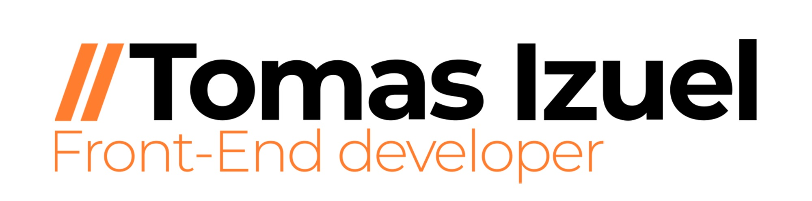

# Hi! :hand: My name is **Tomas Izuel**
## I'm a student of systems engineering and freelancer web developer

___
### Studies
* Electronic technician in automation and process control
* Third year of systems engineering
* Autodidact
* Cyber ​​security research lab

### What i do
* Front-end web development

### Technologies
* HTML 
* CSS 
* Bootstrap 
* Less/Sass 
* JavaScript 
* ReactJS 
